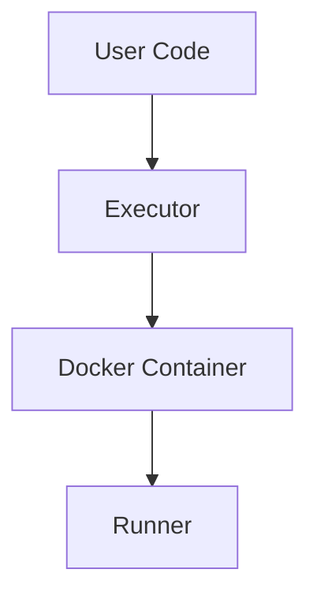

# Architecture

Pybox is intentionally minimal and relies on Docker for isolation.

## Execution flow

## Components

### Executor

Responsible for:
- Building Docker command
- Enforcing limits
- Handling timeouts
- Parsing results

### Runner (inside container)

- Reads JSON from stdin
- Executes code using `exec`
- Returns result via stdout

### Config

Defines:
- CPU / memory limits
- Security settings
- Runtime constraints

## Security model

Pybox depends heavily on Docker isolation:

- `--cap-drop=ALL`
- `--read-only`
- `--network none`
- `seccomp` / `apparmor`

⚠️ The Python runner itself is **not secure** without Docker.
